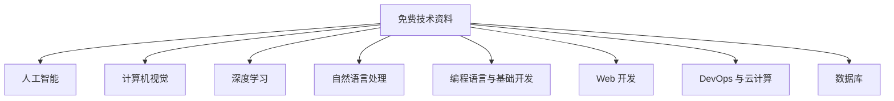

# AI-IT-Free-PDF-Resources
From the big model LLM， From autonomous driving, wireless communication, to blockchain security, everything you pay attention to is available and profound.

**不止AI，IT的半壁江山也为你铺好路！**

想从零学Python？有！
想啃前端、后端、移动开发？有！
想掌握Docker、K8s这些DevOps利器？有！
甚至数据库优化、Git版本控制、软件工程基础……凡是你技术成长路上会遇到的，都帮你备好了。

**📚 部分精选免费资料方向（数量太多，放不下全部）：**

（👆 这只是免费资料的一部分结构展示，具体内容更多更细致！）

**为什么我强烈推荐你把这个“羊毛”薅到底？**

1.  **它懂你迷茫：** 资料是系统组织好的，不是网上随便扒拉的几篇博客。从概念到实战，条理清晰，帮你建立扎实的知识体系，不再“裸泳”。
2.  **它追逐前沿：** 从大模型、LLM，到自动驾驶、无线通信，再到区块链安全，你关注的，它都有，而且是深度的。

**这不是普通的“免费”，这是一次珍贵的知识共享！**

我们精心整理了上百篇、上千章的优质内容，涵盖当下最热门、最核心的技术领域：
*   **人工智能（AI）**：从零基础概念，到深度学习算法精讲、AI核心原理、强化学习，再到AI伦理与应用案例，为你构建AI的知识全景图。
*   **计算机视觉（CV）**：从图像处理基础，到CNN深度解析、目标检测、图像分割、人脸识别，甚至自动驾驶中的CV应用，带你洞察“机器之眼”的奥秘。
*   **自然语言处理（NLP）**：从文本预处理，到Transformer模型详解、情感分析、机器翻译，直至对话系统设计，让你驾驭语言的力量。
*   **深度学习（DL）**：框架对比、神经网络优化、模型训练调参、迁移学习、GAN……助你成为深度学习的实战高手。
*   **编程语言与基础开发**：Python、Java、C++、Go，以及前端（HTML/CSS/JS、React/Vue）、后端（SpringBoot/Django）、移动开发（Android/iOS/Flutter），帮你打牢开发基石。
*   **DevOps与云计算**：Docker、Kubernetes、CI/CD、主流云平台、自动化运维，让你成为高效的系统构建者。
*   **数据库技术**：MySQL、NoSQL、分布式数据库、性能调优，数据世界的规则由你掌握。
*   **以及更多……** 语音识别、时间序列分析、无线通信、软件工程、Git版本控制、高效学习方法……我们力求涵盖技术人的方方面面。

### 如何下载？

请访问以下网址，即可免费获取您所需的文档：

[https://www.aiknowledge.cn/home/view_doc?id=12063](https://www.aiknowledge.cn/home/view_doc?id=12063)

### 具体请看如下：📚 免费的AI、IT领域PDF资源大放送 📚

---

#### 通用热门技术领域：

*   **《零基础入门人工智能：概念、方向与应用全解析》**
*   **《深度学习核心算法精讲：从原理到实践》**
*   **《TensorFlow/PyTorch 入门实战：快速搭建你的第一个AI模型》**
*   **《Python数据科学基础：常用库与数据处理技巧》**
*   **《从零开始构建你的技术知识体系：终身学习路线图》**
*   **《GitHub 精选：2024最值得关注的开源技术项目》**
*   **《技术面试高频考点整理：AI/CV/NLP方向》**

---

#### 人工智能 (AI)：

*   **《AI核心算法原理：从机器学习到神经网络》**
*   **《强化学习入门：探索智能体的决策之路》**
*   **《AI伦理与安全：未来发展不可忽视的议题》**
*   **《AI在各行业的应用案例分析》**

---

#### 计算机视觉 (CV)：

*   **《计算机视觉基础：图像处理与特征提取》**
*   **《CNN 深度解析：图像识别的基石》**
*   **《目标检测算法详解： YOLO、Faster R-CNN等》**
*   **《图像分割技术入门与实战》**
*   **《人脸识别技术原理与应用》**
*   **《计算机视觉在自动驾驶中的应用》**

---

#### 深度学习 (DL)：

*   **《深度学习框架对比：TensorFlow vs PyTorch》**
*   **《神经网络优化技巧：激活函数、损失函数、优化器选择》**
*   **《模型训练与调参指南：提高模型性能的秘诀》**
*   **《迁移学习与Fine-tuning实战》**
*   **《生成对抗网络 (GAN) 原理与应用》**

---

#### 自然语言处理 (NLP)：

*   **《自然语言处理基础：文本预处理与特征工程》**
*   **《Transformer 模型详解：NLP领域的革新者》**
*   **《文本分类与情感分析实战》**
*   **《机器翻译技术原理与实现》**
*   **《对话系统设计与构建》**
*   **《NLP在智能客服和内容分析中的应用》**

---

#### 语音识别：

*   **《语音识别技术基础：声学模型与语言模型》**
*   **《Kaldi 工具包入门与实践》**
*   **《端到端语音识别模型：原理与优势》**

---

#### 时间序列分析：

*   **《时间序列分析基础：趋势、周期与季节性》**
*   **《ARIMA 模型详解：经典时间序列预测方法》**
*   **《基于深度学习的时间序列预测模型》**
*   **《时间序列异常检测技术》**

---

#### 无线通信：

*   **《5G 技术原理与关键技术》**
*   **《物联网通信技术概览》**
*   **《无线传感器网络基础》**
*   **《信号处理在无线通信中的应用》**
*   **《无线通信系统设计与优化》**

---

#### 编程语言和基础开发：

*   **《Python 入门到实践：成为全栈开发者的第一步》**
*   **《Java核心编程：面向对象与常用API详解》**
*   **《C++ 高级编程技巧与内存管理》**
*   **《Go 语言入门与并发编程实践》**
*   **《前端开发基础：HTML、CSS、JavaScript完全指南》**
*   **《SQL 基础：数据库查询与管理入门》**
*   **《数据结构与算法基础：提升你的编程内功》**

---

#### Web 开发：

*   **《React/Vue 入门与组件化开发》**
*   **《前端框架对比与选择指南》**
*   **《后端开发框架：Spring Boot/Django/Node.js 快速入门》**
*   **《RESTful API 设计与实现》**
*   **《微服务架构基础：概念与实践》**
*   **《Web 安全基础：常见漏洞与防护措施》**

---

#### 移动开发：

*   **《Android 开发入门：UI设计与基本组件》**
*   **《iOS 开发入门：Swift语言与UI开发》**
*   **《跨平台开发框架：React Native/Flutter 快速上手》**
*   **《移动应用安全基础》**

---

#### DevOps 和云计算：

*   **《Docker 入门与容器化实践》**
*   **《Kubernetes 基础：容器编排入门》**
*   **《CI/CD 实践：自动化构建、测试与部署》**
*   **《云平台入门：AWS/阿里云/腾讯云基础服务介绍》**
*   **《自动化运维工具：Ansible/Chef/Puppet 基础》**
*   **《监控与日志分析：保证系统稳定性》**

---

#### 数据库：

*   **《MySQL 基础：数据库设计与优化》**
*   **《NoSQL 数据库概览：MongoDB、Redis 等》**
*   **《分布式数据库原理与实践》**
*   **《数据库性能调优技巧》**

---

#### 其他相关领域：

*   **《软件工程基础：开发流程与项目管理》**
*   **《版本控制工具：Git 基础与进阶》**
*   **《单元测试与集成测试实践》**
*   **《高效学习编程的方法与技巧》**

### 如何下载？

请访问以下网址，即可免费获取您所需的文档：

[https://www.aiknowledge.cn/home/view_doc?id=12063](https://www.aiknowledge.cn/home/view_doc?id=12063)
